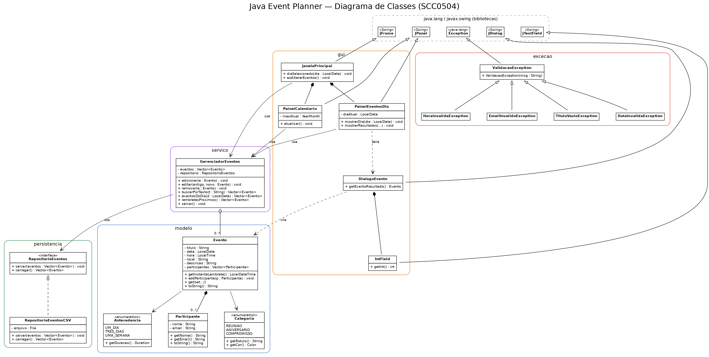

# Arquitetura

O código é organizado em **camadas no estilo MVC** (Model-View-Controller,
Cap. 13 das aulas). A **regra de ouro**: a GUI conversa **apenas** com o
`GerenciadorEventos` (serviço); este, por sua vez, fala com a persistência
**através de uma interface**. Trocar o meio de armazenamento não afeta o resto.

## Pacotes

| Pacote | Papel (MVC) | Principais classes |
|---|---|---|
| `app` | Inicialização | `EventPlannerApp` (main) |
| `modelo` | **Model** (estado/dados) | `Evento`, `Participante`, `Categoria`, `Antecedencia` |
| `excecao` | Validação | `ValidacaoException` + 4 subclasses |
| `persistencia` | **Controller** (I/O) | `RepositorioEventos` (interface), `RepositorioEventosCSV` |
| `servico` | **Controller** (regras) | `GerenciadorEventos` |
| `gui` | **View** (Swing) | `JanelaPrincipal`, `PainelCalendario`, `PainelEventosDia`, `PainelAgenda`, `PainelLinhaTempo`, `IconeCategorias`, `DialogoEvento`, `IntField` |

## Diagrama de classes



Fontes editáveis: [`diagrama_classes.puml`](../diagrama_classes.puml) (PlantUML) e
[`diagrama_classes.dot`](../diagrama_classes.dot) (Graphviz, notação das aulas).

Para regenerar as imagens a partir do `.dot`:

```bash
dot -Tpng diagrama_classes.dot -o diagrama_classes.png
dot -Tsvg diagrama_classes.dot -o diagrama_classes.svg
```

## Fluxo de um clique (programação orientada a eventos)

1. O usuário **clica num dia** do `PainelCalendario`.
2. O painel avisa o seu ouvinte `OuvinteDeDia` — implementado pela `JanelaPrincipal`.
3. A `JanelaPrincipal` manda o `PainelEventosDia` e o `PainelAgenda` **mostrarem o dia**.
4. Ao **criar/editar/excluir** um evento, o `PainelEventosDia` (ou a linha do tempo)
   avisa o contrato `Atualizavel` → a `JanelaPrincipal` chama `atualizarTudo()`,
   que **re-pinta as 3 colunas e salva** em disco.

Esse desacoplamento (interfaces-papel + camada de serviço) é o que deixa o sistema
fácil de evoluir — por exemplo, adicionar recorrência de eventos ou trocar o CSV
por um banco — sem reescrever o que já existe.

Detalhes classe a classe: **[EXPLICACAO_CLASSES.md](../EXPLICACAO_CLASSES.md)**.
