# Fichas das Classes (UML)

Uma seção por classe/interface do diagrama, com o **recorte do UML**, **Herança**, **Polimorfismo** e **Exceptions**. Conteúdo equivalente às fichas, agora em Markdown.

> Veja também: **[Arquitetura](Arquitetura.md)** · **[Conceitos de POO](Conceitos-POO.md)** · diagrama completo em `diagrama_classes.png`.

## Módulos (pacotes)

| Módulo | Descrição |
|---|---|
| `app` | Ponto de entrada: monta as camadas (repositório, serviço) e abre a janela principal. |
| `modelo` | Model (estado/dados): representa eventos, participantes e os tipos fixos (enums). |
| `excecao` | Erros de validação: exceções próprias (checked) com mensagens amigáveis ao usuário. |
| `persistencia` | Controller de I/O: contrato e implementação para salvar/carregar os eventos em arquivo. |
| `servico` | Controller (regras): valida, busca, calcula lembretes e intermedeia a persistência. |
| `gui` | View (Swing): janelas e painéis que desenham a interface e tratam os eventos do usuário. |

## Índice

- **`app`** — [EventPlannerApp](#eventplannerapp)
- **`modelo`** — [Evento](#evento) · [Participante](#participante) · [Categoria](#categoria) · [Antecedencia](#antecedencia)
- **`excecao`** — [ValidacaoException](#validacaoexception) · [TituloVazioException](#titulovazioexception) · [DataInvalidaException](#datainvalidaexception) · [HoraInvalidaException](#horainvalidaexception) · [EmailInvalidoException](#emailinvalidoexception)
- **`persistencia`** — [RepositorioEventos](#repositorioeventos) · [RepositorioEventosCSV](#repositorioeventoscsv)
- **`servico`** — [GerenciadorEventos](#gerenciadoreventos)
- **`gui`** — [JanelaPrincipal](#janelaprincipal) · [PainelCalendario](#painelcalendario) · [OuvinteDeDia](#ouvintededia) · [PainelEventosDia](#paineleventosdia) · [Atualizavel](#atualizavel) · [PainelAgenda](#painelagenda) · [PainelLinhaTempo](#painellinhatempo) · [IconeCategorias](#iconecategorias) · [DialogoEvento](#dialogoevento) · [IntField](#intfield)

---

# Módulo `app`

_Ponto de entrada: monta as camadas (repositório, serviço) e abre a janela principal._

## EventPlannerApp

módulo `app`

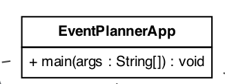

- **Descrição:** Classe com o método `main`; inicializa o Look and Feel, a persistência, o serviço e a GUI (criada na thread de eventos via `SwingUtilities.invokeLater`).
- **Herança:** Não estende outra classe (apenas, implicitamente, `Object`). É uma classe utilitária de inicialização — não faz sentido herdar dela.
- **Polimorfismo:** Aplica polimorfismo ao instanciar `RepositorioEventosCSV` e usá-lo apenas pelo tipo da interface `RepositorioEventos`, repassado ao `GerenciadorEventos`.
- **Exceptions:** Captura `Exception` genérica ao definir o Look and Feel (falha não é crítica). Os lembretes das próximas 24h são exibidos via `JOptionPane`.
- _Referência nas aulas:_ Cap. 13 (GUIs/MVC) · Cap. 10 (exceções)

---

# Módulo `modelo`

_Model (estado/dados): representa eventos, participantes e os tipos fixos (enums)._

## Evento

módulo `modelo`

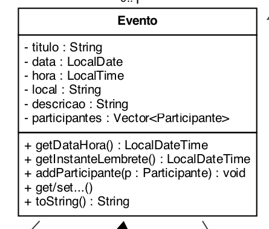

- **Descrição:** Classe central do Model: guarda título, data, hora, local, descrição, categoria, antecedência e a lista de participantes.
- **Herança:** Não estende outra classe (só `Object`). Em vez de herança, usa **composição**: TEM-UM `Vector<Participante>`, uma `Categoria` e uma `Antecedencia`.
- **Polimorfismo:** Sobrescreve `toString()` para descrever o evento em uma linha (usado nas `JList`). `getInstanteLembrete()` combina data/hora menos a antecedência.
- **Exceptions:** Não lança exceções: a validação dos seus dados é responsabilidade do `GerenciadorEventos`.
- _Referência nas aulas:_ Cap. 3 (encapsulamento) · Cap. 8 (toString/composição)

## Participante

módulo `modelo`

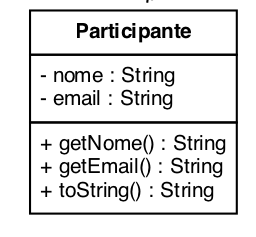

- **Descrição:** Dado simples (nome + e-mail) de quem participa de um evento.
- **Herança:** Não estende outra classe (só `Object`). Classe de dados pura (getters/setters).
- **Polimorfismo:** Sobrescreve `toString()` para se exibir como `Nome <email>` automaticamente em `JList` e `println`.
- **Exceptions:** Não lança exceções diretamente; o e-mail é validado no serviço, que pode lançar `EmailInvalidoException`.
- _Referência nas aulas:_ Cap. 3 (encapsulamento) · Cap. 8 (toString)

## Categoria

`«enumeration»` · módulo `modelo`

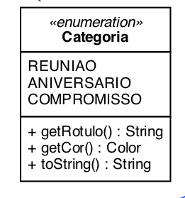

- **Descrição:** Conjunto fixo de tipos de evento (`REUNIAO`, `ANIVERSARIO`, `COMPROMISSO`), cada um com um rótulo e uma cor.
- **Herança:** É um **enum**: estende implicitamente `java.lang.Enum` e NÃO pode ser subclassificada — daí a decisão de não criar subclasses de `Evento` por categoria.
- **Polimorfismo:** Sobrescreve `toString()` (mostra o rótulo). `getCor()` é usado de forma polimórfica na pintura do calendário e dos cards.
- **Exceptions:** `Categoria.valueOf(...)` lança `IllegalArgumentException` se o texto do CSV não corresponder a uma constante (tratado na leitura).
- _Referência nas aulas:_ Cap. 8 (polimorfismo) · enum: recurso além das aulas

## Antecedencia

`«enumeration»` · módulo `modelo`

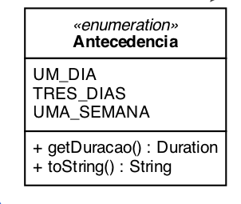

- **Descrição:** Quanto tempo antes avisar (`UM_DIA`, `TRES_DIAS`, `UMA_SEMANA`), cada constante com uma `Duration`.
- **Herança:** É um **enum** (estende `java.lang.Enum`); conjunto fechado de valores, sem herança.
- **Polimorfismo:** Sobrescreve `toString()`; `getDuracao()` é consumido por `Evento.getInstanteLembrete()`.
- **Exceptions:** `valueOf(...)` lança `IllegalArgumentException` para valor inválido vindo do CSV (capturado na carga, que ignora a linha).
- _Referência nas aulas:_ Cap. 8 (polimorfismo) · enum: recurso além das aulas

---

# Módulo `excecao`

_Erros de validação: exceções próprias (checked) com mensagens amigáveis ao usuário._

## ValidacaoException

módulo `excecao`

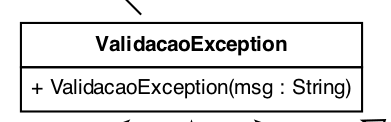

- **Descrição:** Superclasse comum de todos os erros de validação do domínio.
- **Herança:** `extends Exception` → é uma exceção **checked** (Cap. 10): o compilador obriga `throws` ou `try/catch`.
- **Polimorfismo:** Habilita o `catch` **polimórfico**: capturar a base `ValidacaoException` pega qualquer subclasse de uma só vez.
- **Exceptions:** É, ela própria, uma exceção; o construtor repassa a mensagem amigável com `super(msg)`.
- _Referência nas aulas:_ Cap. 10 (exceções) · Cap. 8 (herança)

## TituloVazioException

módulo `excecao`

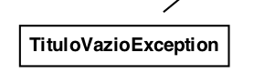

- **Descrição:** Erro específico: o título do evento está vazio.
- **Herança:** `extends ValidacaoException` (→ `Exception`).
- **Polimorfismo:** Tratada de forma polimórfica pelo `catch (ValidacaoException)` na GUI.
- **Exceptions:** Lançada por `GerenciadorEventos.validar()` quando o título é nulo ou em branco.
- _Referência nas aulas:_ Cap. 10 (exceções checked)

## DataInvalidaException

módulo `excecao`

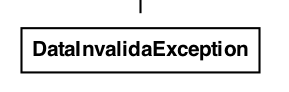

- **Descrição:** Erro específico: a data do evento não foi informada/é inválida.
- **Herança:** `extends ValidacaoException` (→ `Exception`).
- **Polimorfismo:** Capturada via superclasse `ValidacaoException` (polimorfismo de exceções).
- **Exceptions:** Lançada por `GerenciadorEventos.validar()` quando a data é nula.
- _Referência nas aulas:_ Cap. 10 (exceções checked)

## HoraInvalidaException

módulo `excecao`

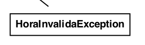

- **Descrição:** Erro específico: a hora do evento não foi informada/é inválida.
- **Herança:** `extends ValidacaoException` (→ `Exception`).
- **Polimorfismo:** Capturada via superclasse `ValidacaoException`.
- **Exceptions:** Lançada por `GerenciadorEventos.validar()` quando a hora é nula.
- _Referência nas aulas:_ Cap. 10 (exceções checked)

## EmailInvalidoException

módulo `excecao`

- **Descrição:** Erro específico: e-mail de participante sem `@`.
- **Herança:** `extends ValidacaoException` (→ `Exception`).
- **Polimorfismo:** Capturada via superclasse `ValidacaoException`.
- **Exceptions:** Lançada por `GerenciadorEventos.validar()` ao verificar o e-mail de cada participante.
- _Referência nas aulas:_ Cap. 10 (exceções checked)

---

# Módulo `persistencia`

_Controller de I/O: contrato e implementação para salvar/carregar os eventos em arquivo._

## RepositorioEventos

`«interface»` · módulo `persistencia`

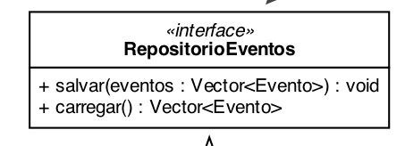

- **Descrição:** Contrato de quem sabe salvar e carregar eventos (define o papel, Cap. 8).
- **Herança:** É uma **interface**: não herda — é **realizada** por classes concretas (ex.: `RepositorioEventosCSV`).
- **Polimorfismo:** Base do polimorfismo da persistência: o resto do sistema enxerga só este tipo, permitindo trocar o armazenamento sem mudanças.
- **Exceptions:** `salvar(...)` declara `throws IOException` (checked); `carregar()` NÃO lança — em falha devolve o que conseguiu (no mínimo lista vazia).
- _Referência nas aulas:_ Cap. 8 (interfaces) · Cap. 10 (IOException)

## RepositorioEventosCSV

módulo `persistencia`

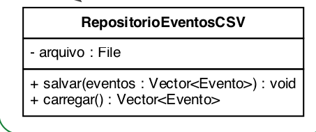

- **Descrição:** Implementação concreta que grava e lê os eventos num arquivo CSV (texto, 1 evento por linha).
- **Herança:** Só `Object`; `implements RepositorioEventos` (realização de interface — triângulo tracejado no UML).
- **Polimorfismo:** É vista pelo serviço apenas como `RepositorioEventos` (dynamic binding): a escolha do CSV fica isolada.
- **Exceptions:** `salvar` lança `IOException` e usa `try/finally` para fechar o arquivo; `carregar` trata cada linha em `try/catch` (tolera arquivo ausente ou linha corrompida).
- _Referência nas aulas:_ Cap. 8 (realização) · Cap. 4 (File/Scanner) · Cap. 10 (try/finally)

---

# Módulo `servico`

_Controller (regras): valida, busca, calcula lembretes e intermedeia a persistência._

## GerenciadorEventos

módulo `servico`

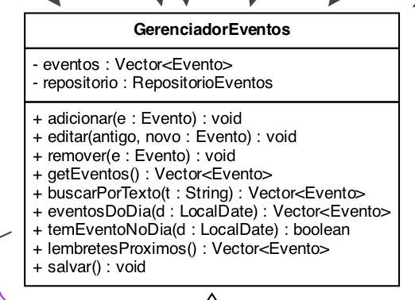

- **Descrição:** "Cérebro"/Controller: mantém a coleção em memória, valida, busca por texto/dia, calcula lembretes e delega a persistência.
- **Herança:** Não estende outra classe (só `Object`). É a única classe com quem a GUI conversa.
- **Polimorfismo:** Depende da **interface** `RepositorioEventos` (não do CSV); agrega um `Vector<Evento>` (agregação no UML).
- **Exceptions:** `adicionar()`/`editar()` declaram `throws ValidacaoException`; `salvar()` propaga `IOException`; `validar()` lança a subclasse específica do erro.
- _Referência nas aulas:_ Cap. 13 (MVC/Controller) · Cap. 10 (exceções)

---

# Módulo `gui`

_View (Swing): janelas e painéis que desenham a interface e tratam os eventos do usuário._

## JanelaPrincipal

módulo `gui`

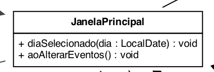

- **Descrição:** Janela principal: monta as três colunas (calendário, lista do dia e linha do tempo) e coordena a aplicação.
- **Herança:** `extends JFrame` — é uma janela de topo (heavyweight, Cap. 13); herda `setVisible`, `pack`, `setJMenuBar`, `add`, etc.
- **Polimorfismo:** `implements PainelCalendario.OuvinteDeDia` E `PainelEventosDia.Atualizavel`: é um `JFrame` e também dois "ouvintes". Sobrescreve `diaSelecionado()` e `aoAlterarEventos()`.
- **Exceptions:** Captura `IOException` ao salvar (`salvarComTratamento`) e mostra um `JOptionPane` amigável em vez de stack trace.
- _Referência nas aulas:_ Cap. 13 (Swing/Split Panes) · Cap. 8 (interfaces)

## PainelCalendario

módulo `gui`

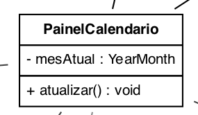

- **Descrição:** Calendário mensal (grade Dom..Sab) com navegação de meses, botão Hoje e destaque dos dias com eventos.
- **Herança:** `extends JPanel` (contêiner leve). Usa `GridLayout`/`BorderLayout` para montar a grade.
- **Polimorfismo:** Declara a interface-papel interna `OuvinteDeDia` (com método `default diaAbrirDetalhe`). Usa `IconeCategorias` (`Icon`) de forma polimórfica.
- **Exceptions:** Não lança exceções; obtém os eventos pelo `GerenciadorEventos`.
- _Referência nas aulas:_ Cap. 13 (GridLayout) · Cap. 4 (eventos)

## OuvinteDeDia

`«interface aninhada»` · módulo `gui`

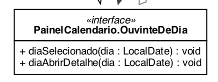

- **Descrição:** Contrato "ouvinte de dia": ser avisado quando o usuário seleciona um dia no calendário.
- **Herança:** Interface aninhada em `PainelCalendario`; não herda — é realizada por quem quiser reagir ao clique.
- **Polimorfismo:** Realizada pela `JanelaPrincipal`. Tem um método `default` (`diaAbrirDetalhe`), recurso do Cap. 8.
- **Exceptions:** Não envolve exceções.
- _Referência nas aulas:_ Cap. 8 (interface · método default)

## PainelEventosDia

módulo `gui`

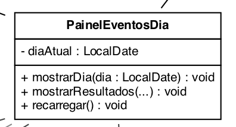

- **Descrição:** Lista de eventos do dia selecionado, com painel de detalhes/participantes e botões Novo/Editar/Excluir.
- **Herança:** `extends JPanel`. Mostra a `JList` dentro de um `JScrollPane`.
- **Polimorfismo:** Declara a interface-papel interna `Atualizavel`. Tem a classe interna `RenderizadorEventoQuebra extends DefaultListCellRenderer` (sobrescreve o desenho da célula).
- **Exceptions:** Captura `ValidacaoException` ao criar/editar e exibe a mensagem por `JOptionPane` (sem stack trace).
- _Referência nas aulas:_ Cap. 13 (JList/JScrollPane) · Cap. 8 (interface interna)

## Atualizavel

`«interface aninhada»` · módulo `gui`

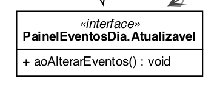

- **Descrição:** Contrato para avisar que os eventos mudaram, de modo que a janela atualize as colunas e salve.
- **Herança:** Interface aninhada em `PainelEventosDia`; é realizada, não herdada.
- **Polimorfismo:** Realizada pela `JanelaPrincipal` (que então chama `atualizarTudo()`).
- **Exceptions:** Não envolve exceções.
- _Referência nas aulas:_ Cap. 8 (interface · papel/contrato)

## PainelAgenda

módulo `gui`

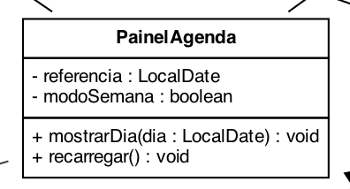

- **Descrição:** Terceira coluna: a agenda em linha do tempo estilo Outlook, com alternância entre os modos Dia e Semana.
- **Herança:** `extends JPanel`. Monta a barra de controle (Dia/Semana, navegação, Hoje) e a rolagem.
- **Polimorfismo:** Compõe e recria o `PainelLinhaTempo` a cada troca de modo/dia; usa um callback `Runnable` para atualizar o resto.
- **Exceptions:** Não lança exceções diretamente.
- _Referência nas aulas:_ Cap. 13 (botões/rolagem)

## PainelLinhaTempo

módulo `gui`

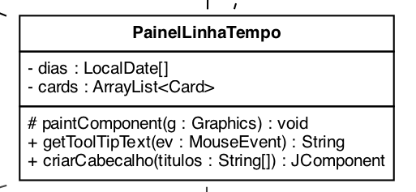

- **Descrição:** Tela de desenho dos cards de evento: posiciona cada um pela hora e divide eventos sobrepostos em subcolunas.
- **Herança:** `extends JPanel` e `implements Scrollable` (interface do Swing) para rolar bem dentro do `JScrollPane`.
- **Polimorfismo:** Sobrescreve `paintComponent` (Drawing) e `getToolTipText`; realizar `Scrollable` é a 3ª forma de polimorfismo.
- **Exceptions:** No duplo-clique, `aplicar()` captura `Exception` da validação ao criar/editar e mostra `JOptionPane`.
- _Referência nas aulas:_ Cap. 13 (Drawing/paintComponent) · Cap. 8 (Scrollable)

## IconeCategorias

módulo `gui`

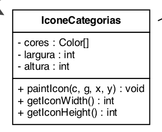

- **Descrição:** Ícone que pinta, lado a lado, as faixas de cor de todas as categorias presentes num dia do calendário.
- **Herança:** Não estende outra classe (só `Object`); `implements javax.swing.Icon`.
- **Polimorfismo:** Realiza a interface `Icon` (`paintIcon`/`getIconWidth`/`getIconHeight`), chamada polimorficamente pelo Swing.
- **Exceptions:** Não envolve exceções.
- _Referência nas aulas:_ Cap. 8 (interface Icon) · Cap. 13 (Drawing)

## DialogoEvento

módulo `gui`

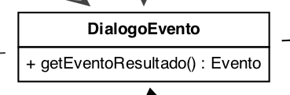

- **Descrição:** Formulário (diálogo modal) para criar ou editar um evento: campos, categoria (radios), antecedência (combo) e participantes.
- **Herança:** `extends JDialog` — é um diálogo modal (Cap. 10/13) que trava a janela principal até ser fechado.
- **Polimorfismo:** Compõe vários `IntField`; cria um objeto `Evento`; usa os enums `Categoria`/`Antecedencia` nos componentes.
- **Exceptions:** `aoSalvar()` trata `NumberFormatException` e `DateTimeException` com `try/catch` e mantém o diálogo aberto ("Fix the Error and Resume").
- _Referência nas aulas:_ Cap. 10 (modal/try-catch) · Cap. 13 (radios/combo)

## IntField

módulo `gui`

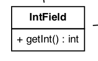

- **Descrição:** Campo de texto especializado que só faz sentido com números inteiros (método `getInt()`).
- **Herança:** `extends JTextField` — mesmo padrão do `ToggleButton` das aulas; o construtor chama `super(colunas)` (Cap. 8).
- **Polimorfismo:** Especializa o `JTextField` acrescentando `getInt()`; herda todo o comportamento de campo de texto.
- **Exceptions:** `getInt()` lança `NumberFormatException` quando o texto não é inteiro — capturada pelo `DialogoEvento`.
- _Referência nas aulas:_ Cap. 8 (herança/super) · Cap. 10 (NumberFormatException)

